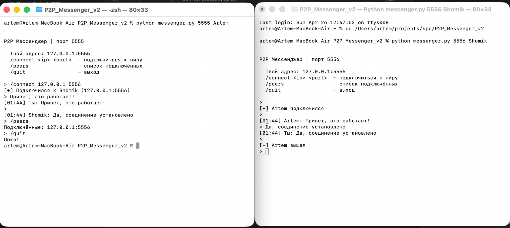

# P2P Console Messenger (Python)

A decentralized Peer-to-Peer (P2P) chat application written in Python. Every node acts simultaneously as both a server and a client.

### Technical Details
- **Architecture**: Decentralized P2P topology.
- **Networking**: Raw TCP sockets (`socket` module) with daemon multithreading for concurrent connections.
- **Protocol**: Custom Length-Prefix Framing ensuring complete payload delivery, with JSON-encoded message bodies (UTF-8).
- **Features**: Thread-safe peer management (using `threading.Lock`), broadcast messaging, and clean socket termination.

### Screenshots

